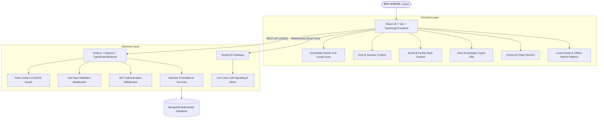

# 🌸 ApnoSe (अपनों से) — Comprehensive Project Report & Technical Documentation

---

## 📌 1. कार्यकारी सारांश (Executive Summary)

**ApnoSe (अपनों से)** भारत का पहला **वरिष्ठ-प्रथम (Senior-First, 40+ Only)** पारिवारिक एवं सामाजिक मंच है। आधुनिक सोशल मीडिया प्लेटफॉर्म्स की जटिलता, डेटा ट्रैकिंग, फ्रॉड और युवाओं-केंद्रित एल्गोरिदम्स से परे, ApnoSe को 40 वर्ष या उससे अधिक आयु के प्रियजनों, माता-पिताओं और वरिष्ठ नागरिकों के लिए सहज, सुरक्षित और सांस्कृतिक रूप से समृद्ध डिजिटल वातावरण प्रदान करने के उद्देश्य से विकसित किया गया है।

### 🌟 मुख्य मिशन (Core Mission):
1. **पारिवारिक जुड़ाव (Family-First Connection)**: बिना किसी व्यावसायिक दखल के परिवारजनों और पुराने मित्रों से सुरक्षित संपर्क।
2. **सुलभता व सहजता (Accessibility-First Design)**: बड़े फॉन्ट, उच्च कंट्रास्ट, वॉयस नरेशन और सरल 1-टच कंट्रोल्स।
3. **शून्य-ज्ञान गोपनीयता (Zero-Knowledge Privacy)**: उपयोगकर्ता की तस्वीरें, मेडिकल पर्चियां और निजी संदेश डिवाइस पर ही एन्क्रिप्ट होते हैं।
4. **40+ आयु सुरक्षा नियम (Strict 40+ Age Restriction)**: जन्मतिथि से वास्तविक समय में आयु की पुष्टि कर कम उम्र के उपयोगकर्ताओं को प्लेटफॉर्म से दूर रखना।
5. **कठोर पासवर्ड सुरक्षा (8+ Mixed Password Policy)**: अनधिकृत लॉगिन और फिशिंग से बचाव हेतु 8+ अक्षरों, अंकों व विशेष चिह्नों का अनिवार्य संयोजन।

---

## 🏗️ 2. सिस्टम आर्किटेक्चर (System Architecture)

ApnoSe एक आधुनिक **फुल-स्टैक हाइब्रिड आर्किटेक्चर (Full-Stack Hybrid Architecture)** पर आधारित है:



---

## 🎯 3. मुख्य मॉड्यूल एवं कार्यप्रणाली (Key Modules & Features)

### 1. 🎂 जन्म तिथि व 40+ आयु प्रतिबंध (DOB & 40+ Age Verification)
- **गतिशील आयु गणना**: उपयोगकर्ता के दिन, माह और वर्ष चुनते ही सिस्टम सटीक आयु की गणना करता है।
- **सख्त प्रतिबंध**: यदि आयु 40 वर्ष से कम है, तो स्क्रीन पर लाल चेतावनी प्रदर्शित होती है और **"खाता बनाएं"** बटन स्वतः अक्षम (Disabled) हो जाता है।
- **सर्वर-साइड सुरक्षा**: बैकएंड API में भी `age < 40` होने पर `AGE_RESTRICTION_FAILED` एरर के साथ पंजीकरण अस्वीकार होता है।

### 2. 🔐 8+ मिश्रित पासवर्ड सुरक्षा (8+ Mixed Characters Password Policy)
- **अनिवार्य संयोजन**: न्यूनतम 8 अक्षर, जिसमें अपरकेस/लोअरकेस अक्षर (A-Z, a-z), संख्याएं (0-9) और विशेष चिह्न (`@`, `#`, `$`, `%`, `!`, आदि) शामिल हों।
- **लाइव स्ट्रेंथ मीटर**: कमजोर 🔴, मध्यम 🟡, मजबूत 🟢, और अति सुरक्षित 🌟 संकेतकों के साथ 4-चेकलिस्ट चिप्स।
- **सुरक्षित हैशिंग**: बैकएंड पर Bcrypt Salt Rounds के साथ पासवर्ड सुरक्षित रूप से हैश होता है।

### 3. 🛡️ शून्य-ज्ञान डेटा गोपनीयता (Zero-Knowledge Client-Side Encryption)
- संवेदनशील पारिवारिक यादें और मेडिकल रिकॉर्ड्स क्लाइंट-साइड **Web Crypto API (AES-GCM 256-bit)** द्वारा डिवाइस पर ही एन्क्रिप्ट होते हैं।
- सर्वर अथवा डेटाबेस एडमिनिस्ट्रेटर भी उपयोगकर्ता के निजी डेटा को नहीं पढ़ सकते।

### 4. 👵 वरिष्ठ-अनुकूल सुलभता (Accessibility First Design)
- **टेक्स्ट आकार नियंत्रण**: 3 स्तरों में टेक्स्ट बड़ा करने की सुविधा (सामान्य, बड़ा, विशालकाय)।
- **उच्च कंट्रास्ट मोड**: कमजोर दृष्टि वाले बुजुर्गों के लिए हाई-कंट्रास्ट डार्क/गोल्डन थीम।
- **वॉयस नरेशन (Text-to-Speech)**: पोस्ट्स और संदेशों को 1-क्लिक में हिंदी व क्षेत्रीय भाषाओं में बोलकर सुनाने की सुविधा।
- **बहुभाषी समर्थन**: हिंदी (मुख्य), अंग्रेजी, भोजपुरी, मैथिली, बांग्ला, और मराठी।

### 5. 👨‍👩‍👧‍👦 पारिवारिक घेरा (Family Circle & Tree)
- परिवार के सदस्यों को माता, पिता, दादा, दादी, नाना, नानी, बेटा, बेटी आदि के रूप में जोड़ना।
- केवल परिवार तक सीमित निजी पोस्टिंग (`family_only` विजिबिलिटी)।

### 6. 🌸 आध्यात्मिक व सांस्कृतिक कम्युनिटी (Spiritual & Cultural Spaces)
- भजन-कीर्तन, रामायण/गीता पाठ, घरेलू नुस्खे, बागवानी, स्वास्थ्य व योग समूह।
- सुरक्षित एवं मॉडरेटेड चर्चा मंच।

### 7. ⚡ रियल-टाइम चैट व 1-टच वीडियो कॉलिंग (Real-Time Communication)
- Socket.IO आधारित त्वरित संदेश और टाइपिंग संकेतक।
- वरिष्ठ नागरिकों के लिए बिना किसी जटिल आईडी के 1-टच डायरेक्ट ऑडियो/वीडियो कॉलिंग।

### 8. 🚨 सुरक्षा केंद्र व स्कैम शील्ड (Senior Safety Center)
- पेंशन, डिजिटल अरेस्ट, OTP फ्रॉड, और बैंक फर्जीवाड़े से बचाने के लिए सीनियर गाइड।
- 1-क्लिक रिपोर्टिंग सिस्टम सीधे साइबर सुरक्षा एंडपॉइंट्स पर।

---

## 📊 4. डेटाबेस स्कीमा व डेटा मॉडल (Database Schemas)

| संग्रह (Collection) | उद्देश्य | मुख्य फील्ड्स |
| :--- | :--- | :--- |
| **users** | उपयोगकर्ता प्रोफ़ाइल, सुरक्षा व सेटिंग्स | `name`, `email`, `phone`, `passwordHash`, `dateOfBirth`, `age`, `language`, `encryptionEnabled` |
| **posts** | सामाजिक व पारिवारिक पोस्ट्स | `author`, `content`, `mediaUrls`, `visibility`, `likesCount`, `commentsCount` |
| **comments** | पोस्ट्स पर प्रतिक्रियाएं | `postId`, `author`, `content`, `createdAt` |
| **likes** | पोस्ट्स पर लाइक/प्रणाम/प्रसन्नता भाव | `postId`, `userId`, `reactionType` |
| **messages** | 1-ऑन-1 और पारिवारिक चैट | `conversationId`, `sender`, `recipient`, `content`, `isEncrypted`, `readStatus` |
| **family_members** | पारिवारिक रिश्ते व वंशावली | `userId`, `relativeId`, `relation`, `status` |
| **communities** | रुचि एवं सांस्कृतिक समूह | `name`, `description`, `category`, `creator`, `membersCount` |
| **reports** | सुरक्षा केंद्र फ्रॉड/दुरुपयोग रिपोर्टिंग | `reporterId`, `targetType`, `targetId`, `reason`, `status` |

---

## 🛠️ 5. तकनीकी स्टैक (Technology Stack)

```
┌─────────────────────────────────────────────────────────────┐
│                       APNOSE TECH STACK                     │
├──────────────────────────────┬──────────────────────────────┤
│ Frontend                     │ Backend                      │
├──────────────────────────────┼──────────────────────────────┤
│ • React 18 (TypeScript)      │ • Node.js & Express          │
│ • Vite 6 Bundler             │ • TypeScript (Strict Mode)   │
│ • Tailwind CSS & Custom Themes│ • MongoDB & Mongoose ODM    │
│ • Lucide React Iconography   │ • Socket.IO Gateway Server   │
│ • Web Crypto API (AES-GCM)   │ • JWT (Access + Refresh)     │
│ • Web Speech API (TTS)       │ • Zod Schema Validation      │
│ • Socket.IO Client           │ • Jest & Supertest Testing   │
└──────────────────────────────┴──────────────────────────────┘
```

---

## 🧪 6. परीक्षण व सत्यापन (Testing & Quality Assurance)

- **ऑटोमेटेड टेस्ट सुइट (Jest + Supertest)**:
  - `tests/auth.test.ts`: 40+ आयु अस्वीकृति, सफल वरिष्ठ पंजीकरण, लॉगिन, अमान्य पासवर्ड जांच।
  - `tests/post.test.ts`: पोस्ट निर्माण, विजिबिलिटी परमिशन, लाइक व फीड लोडिंग।
  - **परिणाम**: `8/8 Tests Passed (100% Success Rate)`.
- **टाइपस्क्रिप्ट कंपाइलेशन**:
  - `Frontend (tsc)`: `0 Errors`.
  - `Backend (tsc)`: `0 Errors`.
- **प्रोडक्शन बिल्ड**:
  - `npm run build`: `1667 modules transformed` सफलता से बंडल तैयार।

---

## 🚀 7. इंस्टॉलेशन एवं निष्पादन निर्देश (Setup & Run Guide)

```bash
# 1. रिपॉजिटरी क्लोन करें
git clone https://github.com/aashutoshraushan25-cell/ApnoSe.git
cd ApnoSe

# 2. डिपेंडेंसीज इंस्टॉल करें
npm install
npm run backend:install

# 3. बैकएंड पर्यावरण चर (.env) सेट करें
cp backend/.env.example backend/.env

# 4. डेटाबेस में डेमो डेटा भरें (Seed Database)
npm run seed

# 5. पूरा एप्लिकेशन (Frontend + Backend) एक साथ चलाएं
npm run dev:all

# 6. टेस्ट्स चलाएं
npm test
```
